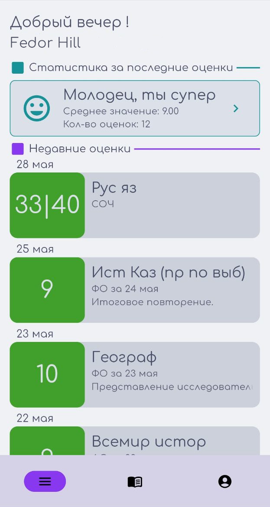
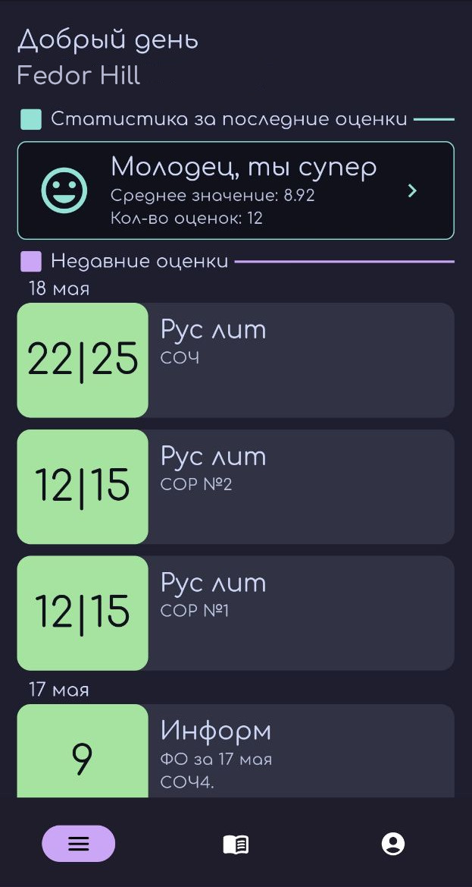

# "Organaiser" project
"Organaiser" project is app for mobile and pc that make schoolkids *life better*. 
It`s improve interaction to see your marks and other data from .  

 

## For developers
- [Installation](#installation)
- [How it works ?](#how-it-works-?)
- [Directory structure](#directory-structure)
- [License](#license)

## Installation
```bash
git clone https://github.com/Fedor-Hill/Organaiser_app.git 
cd Organaiser_app 
flutter gen-l10n
flutter run 
```

## How it works ?
 **provide** to us an API methods, and i just make a requests to fetch data from portal. The main thing is availability account. You can find more about action with API in data directory. 

## Directory structure
In lib: 
   * **data**: Backend side. Like API connect and other things and etc.
   * **domain**: Models contain. In here i contain Class and Abstract class models.
   * **l10n**: For localization. Language ну ты понял (:
   * **route**: .
   * **theme and ui**: idk what in here, lol. 
   * **main.dart**: he is main dude. 

## License
This project is licensed under the GNU General Public License v3.0 - see the [LICENSE](LICENSE) file for details.
